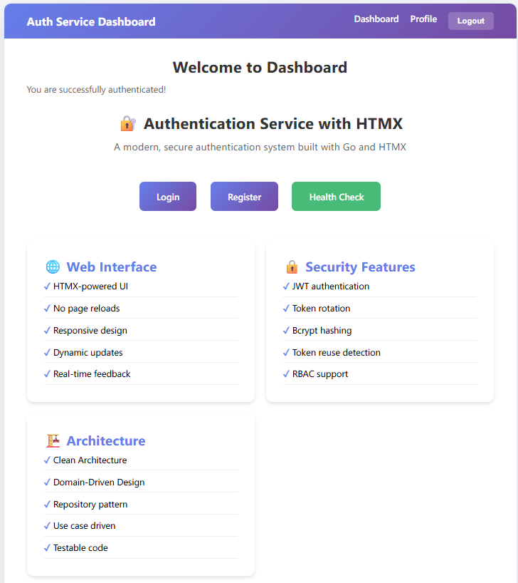

# Authentication Service - Clean Architecture + DDD

A production-ready authentication service built with Go, implementing Clean Architecture and Domain-Driven Design principles.



## 📋 Table of Contents
- [Architecture](#️-architecture)
- [Features](#-features)
- [Quick Start](#-quick-start)
- [Web UI](#-web-ui)
- [API Endpoints](#-api-endpoints)
- [Token Flow](#-token-flow-demo)
- [Testing](#-testing)
- [Technology Stack](#-technology-stack)
- [Project Highlights](#-project-highlights-for-interviews)

## 🏗️ Architecture

This project follows **Clean Architecture** principles with **Domain-Driven Design** patterns, ensuring maintainability, testability, and scalability.

### Clean Architecture Layers

```
├── cmd/
│   └── server/          # Application entry point
├── internal/
│   ├── domain/          # Domain Layer (Business Logic)
│   │   ├── entity/      # Domain entities (User, RefreshToken, Role)
│   │   ├── valueobject/ # Value objects (Email, Password)
│   │   ├── repository/  # Repository interfaces
│   │   └── service/     # Domain services
│   ├── application/     # Application Layer (Use Cases)
│   │   ├── dto/         # Data transfer objects
│   │   └── usecase/     # Business use cases
│   ├── infrastructure/  # Infrastructure Layer (External dependencies)
│   │   ├── persistence/ # Database implementations
│   │   ├── security/    # JWT, bcrypt implementations
│   │   └── config/      # Configuration management
│   └── interface/       # Interface Layer (HTTP handlers)
│       └── http/
│           ├── handler/    # HTTP handlers
│           └── middleware/ # Auth, logging, CORS middleware
├── pkg/
│   └── errors/          # Application errors
└── migrations/          # Database migrations
```

## ✨ Features

### 🎨 Web UI (HTMX)
- **Modern Web Interface** - Clean, responsive UI built with HTMX and vanilla JavaScript
- **Login/Register Pages** - User-friendly authentication forms with real-time validation
- **Dashboard** - Protected user dashboard showing comprehensive profile information
- **Dynamic Updates** - HTMX-powered interactions without full page reloads
- **Token Management** - Automatic JWT token handling with refresh token rotation
- **Responsive Design** - Works seamlessly on desktop and mobile devices

### 🔐 Security & Authentication
- **JWT Access Tokens** - Short-lived stateless tokens for API access (15 min default)
- **Refresh Tokens** - Long-lived tokens for obtaining new access tokens (7 days default)
- **Token Rotation** - Automatic refresh token rotation for enhanced security
- **Token Family Tracking** - Detects and prevents refresh token reuse attacks
- **Bcrypt Password Hashing** - Industry-standard secure password storage (cost factor 10)
- **Password Validation** - Enforces strong password requirements
- **Secure Token Storage** - PostgreSQL with proper indexing and cascading deletes

### 👥 RBAC (Role-Based Access Control)
- **Three-tier role system**: User, Moderator, Admin
- **Hierarchical permission checking** - Admins inherit Moderator & User permissions
- **Middleware-based route protection** - Declarative access control
- **Easy to extend** - Add custom roles without changing core logic
- **Per-route authorization** - Fine-grained access control

### Clean Architecture Benefits
- **Separation of Concerns** - Each layer has clear responsibilities
- **Testability** - Easy to unit test business logic
- **Flexibility** - Easy to swap implementations (e.g., database, auth provider)
- **Maintainability** - Clear code organization and dependencies

### DDD Patterns
- **Entities** - Rich domain models with behavior (User, RefreshToken)
- **Value Objects** - Immutable objects with validation (Email, Password)
- **Repositories** - Data access abstraction
- **Domain Services** - Cross-entity business logic
- **Use Cases** - Application-specific business rules

## 🚀 Quick Start

### Prerequisites


- Go 1.22+
- PostgreSQL 14+
- Docker & Docker Compose (optional)

### Option 1: Docker Compose (Recommended)

The easiest way to run the entire stack:

```bash
# Start all services (app + database)
docker compose up --build -d

# View logs
docker compose logs -f auth-service

# View all logs
docker compose logs -f

# Stop services
docker compose down

# Stop and remove volumes (clean state)
docker compose down -v
```

The application will be available at:
- **Web UI**: `http://localhost:8080/web/login`
- **API**: `http://localhost:8080/api/v1/auth/*`
- **Health Check**: `http://localhost:8080/health`

### Option 2: Local Development

1. **Clone and setup**
```bash
cd d:\project\auth-go
```

2. **Install dependencies**
```bash
go mod tidy
```

3. **Setup database**
```bash
# Create database
createdb auth_db

# Run migrations
psql -d auth_db -f migrations/001_init.sql
```

4. **Configure environment** (`.env` file already included)
Edit `.env` file if needed:
```env
# Server
SERVER_PORT=8080
SERVER_HOST=0.0.0.0

# Database
DB_HOST=localhost
DB_PORT=5432
DB_USER=postgres
DB_PASSWORD=postgres
DB_NAME=auth_db
DB_SSL_MODE=disable

# JWT
JWT_SECRET_KEY=your-super-secret-key-change-in-production
JWT_ACCESS_TOKEN_EXPIRY_MINUTES=15
JWT_REFRESH_TOKEN_EXPIRY_DAYS=7
JWT_ISSUER=auth-go
```

5. **Run the server**
```bash
go run cmd/server/main.go
# or use Make
make run
```

### Using Make Commands

```bash
make help          # Show all available commands
make build         # Build the application
make run           # Run locally
make docker-up     # Start with Docker Compose
make docker-down   # Stop Docker services
make docker-logs   # View logs
```

## 🌐 Web UI

The application includes a modern web interface built with HTMX:

- **Home**: `http://localhost:8080/` - Landing page with health check
- **Login**: `http://localhost:8080/web/login` - User login page
- **Register**: `http://localhost:8080/web/register` - New user registration
- **Dashboard**: `http://localhost:8080/web/dashboard` - Protected dashboard (requires authentication)
- **Profile**: `http://localhost:8080/web/profile` - Comprehensive user profile page (requires authentication)

### UI Features
- **Clean, Modern Design** - Responsive gradient styling with smooth animations
- **Dynamic Profile Display** - Shows complete user information:
  - User ID (monospace font for technical data)
  - Email address
  - Account status (color-coded: green for active, red for inactive)
  - User roles (badge display)
  - Account creation timestamp
  - Last update timestamp
  - Last login timestamp (or "Never" if not logged in yet)
- **Automatic Token Management** - Handles JWT access tokens and refresh token rotation
- **Vanilla JavaScript** - Form submissions using Fetch API for better control
- **Real-time Updates** - HTMX-powered dynamic content loading without full page reloads
- **Error Handling** - User-friendly error messages and validation feedback
- **Seamless API Integration** - Direct communication with REST API endpoints

See [web/README.md](web/README.md) for more details about the web UI implementation.

## 📡 API Endpoints

### Public Endpoints

#### Register
```bash
POST /api/v1/auth/register
Content-Type: application/json

{
  "email": "user@example.com",
  "password": "SecurePass123!"
}
```

#### Login
```bash
POST /api/v1/auth/login
Content-Type: application/json

{
  "email": "user@example.com",
  "password": "SecurePass123!"
}

# Response
{
  "access_token": "eyJhbGc...",
  "refresh_token": "abc123...",
  "token_type": "Bearer",
  "expires_in": 900
}
```

#### Refresh Token
```bash
POST /api/v1/auth/refresh
Content-Type: application/json

{
  "refresh_token": "abc123..."
}

# Response
{
  "access_token": "eyJhbGc...",
  "refresh_token": "def456...",  # New rotated token
  "token_type": "Bearer",
  "expires_in": 900
}
```

### Protected Endpoints

#### Get Profile
```bash
GET /api/v1/auth/profile
Authorization: Bearer eyJhbGc...

# Response
{
  "id": "uuid",
  "email": "user@example.com",
  "roles": ["user"]
}
```

#### Logout
```bash
POST /api/v1/auth/logout
Authorization: Bearer eyJhbGc...
```

#### Admin Only (RBAC Example)
```bash
GET /api/v1/admin/users
Authorization: Bearer eyJhbGc...  # Requires admin role
```

## 🔐 Token Flow Demo

### 1. Login Flow
```
User Login
    ↓
Validate Credentials
    ↓
Generate Access Token (JWT, 15min)
Generate Refresh Token (Random, 7 days)
    ↓
Store Refresh Token in DB (with token_family)
    ↓
Return Both Tokens
```

### 2. Access Protected Resource
```
Client Request
    ↓
Extract Bearer Token
    ↓
Validate JWT Signature & Expiry
    ↓
Extract User Claims (ID, Email, Roles)
    ↓
Add to Request Context
    ↓
Check RBAC Permissions
    ↓
Process Request
```

### 3. Token Refresh (Rotation)
```
Refresh Request
    ↓
Find Refresh Token in DB
    ↓
Check if Revoked → If yes: SECURITY THREAT, revoke entire family
    ↓
Check if Expired → If yes: Reject
    ↓
Revoke Current Token (used once)
    ↓
Generate New Access Token
Generate New Refresh Token (same family)
    ↓
Store New Refresh Token with parent reference
    ↓
Return New Token Pair
```

### 4. Token Reuse Detection
```
Attacker uses old refresh token
    ↓
Token found but is_revoked = true
    ↓
SECURITY BREACH DETECTED
    ↓
Revoke ALL tokens in token_family
    ↓
User must re-authenticate
```

## 🧪 Testing

### Using Web UI (Easiest)

1. Start the application: `docker compose up -d`
2. Open browser: `http://localhost:8080/web/login`
3. Register a new account
4. Login and explore the dashboard and profile pages
5. Test token refresh by waiting or manually refreshing

### Using Postman Collection (Recommended for API)

Import the Postman collection for easy API testing:

1. Open Postman
2. Import `postman/Auth-Service.postman_collection.json`
3. Run requests in order:
   - Health Check
   - Register User
   - Login (tokens auto-saved)
   - Get Profile (uses saved token)
   - Refresh Token
   - Logout

See [postman/README.md](postman/README.md) for detailed instructions.

### Using cURL

#### Test User Registration
```bash
curl -X POST http://localhost:8080/api/v1/auth/register \
  -H "Content-Type: application/json" \
  -d '{
    "email": "test@example.com",
    "password": "SecurePass123!"
  }'
```

#### Test Login
```bash
curl -X POST http://localhost:8080/api/v1/auth/login \
  -H "Content-Type: application/json" \
  -d '{
    "email": "test@example.com",
    "password": "SecurePass123!"
  }'
```

#### Test Protected Endpoint
```bash
TOKEN="your_access_token_here"

curl http://localhost:8080/api/v1/auth/profile \
  -H "Authorization: Bearer $TOKEN"
```

#### Test Token Refresh
```bash
curl -X POST http://localhost:8080/api/v1/auth/refresh \
  -H "Content-Type: application/json" \
  -d '{
    "refresh_token": "your_refresh_token_here"
  }'
```

## 🎯 Interview Talking Points

### Why Clean Architecture?
- **Independence**: Business logic doesn't depend on frameworks, UI, or database
- **Testability**: Core business logic can be tested without external dependencies
- **Flexibility**: Easy to swap implementations (PostgreSQL → MongoDB, JWT → OAuth2)
- **Maintainability**: Clear boundaries and responsibilities

### Security Features
1. **JWT Access Tokens** - Stateless, short-lived, signed tokens
2. **Refresh Token Rotation** - Each refresh generates a new token, old one revoked
3. **Token Family Tracking** - Detect and prevent token reuse attacks
4. **Bcrypt Password Hashing** - Industry-standard password security
5. **RBAC Middleware** - Role-based access control at the route level

### Go Showcase
- **Context Propagation** - User claims passed via context through middleware
- **Interface-Based Design** - Easy to mock and test
- **Dependency Injection** - All dependencies injected in main.go
- **Error Handling** - Centralized error types and handling
- **Middleware Pattern** - Composable request processing

### Token Expiration Handling
- **Access Token Expired** → Use refresh token to get new pair
- **Refresh Token Expired** → User must log in again
- **Refresh Token Reused** → Security breach, revoke all tokens in family

## 📝 Password Requirements
- Minimum 8 characters
- At least one uppercase letter
- At least one lowercase letter
- At least one number

## 🔧 Technology Stack
- **Go 1.22** - Programming language
- **PostgreSQL 14+** - Relational database
- **JWT (golang-jwt/jwt v5)** - Token generation and validation
- **Bcrypt** - Secure password hashing
- **HTMX 1.9.10** - Modern web UI interactions
- **Docker & Docker Compose** - Containerization and orchestration
- **Standard Library** - HTTP server (no heavy framework dependency)

## 📚 Project Highlights for Interviews

1. **Clean Architecture** - Clear separation of concerns across 4 layers (Domain, Application, Infrastructure, Interface)
2. **Domain-Driven Design** - Rich domain models, value objects, repository pattern, domain services
3. **Security First** - Token rotation, reuse detection, bcrypt hashing, RBAC
4. **Production Ready** - Docker containerization, environment configuration, structured logging
5. **Modern Web UI** - HTMX for dynamic interactions, responsive design, real-time updates
6. **No Heavy Framework** - Pure Go using standard library for HTTP server
7. **Database Design** - Proper indexing, foreign keys, cascading deletes, migration management
8. **Best Practices** - Context propagation, dependency injection, interface-based design
9. **Comprehensive Testing** - Postman collection, cURL examples, Web UI for manual testing
10. **Well Documented** - Extensive README, code comments, API documentation

## 🎓 Learning Resources

This project demonstrates:
- OAuth2-like token flow
- Clean Architecture in Go
- DDD tactical patterns
- JWT best practices
- Secure authentication design
- RBAC implementation
- Middleware patterns
- Context propagation
- Repository pattern

## 📄 License

MIT License - Feel free to use this as a portfolio project or learning resource.
